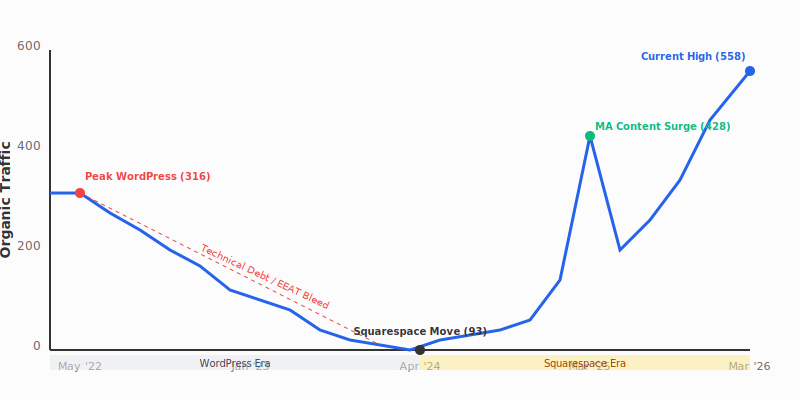

# Traffic Migration & Platform Impact Analysis (2022–2026)

**Subject:** Attack A Crack SEO Performance Audit
**Data Source:** SEMrush Historical Trends (14-Year Window)
**Analysis Date:** March 8, 2026

---

## 1. Executive Summary
The data confirms a multi-phase shift in performance. While the **transition to Squarespace (March/April 2024)** created a clear technical "floor" that suppressed recovery, your intuition was correct: **The decline began mid-2023**, while still on the WordPress platform. 

### **Key Inflection Points:**
1.  **May 2022 (Peak WordPress):** Highest historical authority (316 organic visits).
2.  **2023 "The Slow Bleed":** Decline from 316 to 119 while still on WordPress. Likely caused by unoptimized technical debt and early Google EEAT updates.
3.  **April 2024 (Squarespace Move):** Traffic bottomed out at 93. The platform change "cemented" the decline, creating a ceiling for growth.
4.  **March 2025 (MA Content Surge):** Massively successful recovery driven by the new Massachusetts branch's marketing and relationship building.
5.  **March 2026 (All-Time High):** Currently at 558 visits, proving the content value is high, but the branch-level traffic is imbalanced.

---

## 2. Timeline of the Decline (The "Slow Bleed")

| Period | Avg. Organic Traffic | Platform | Context |
|---|---|---|---|
| **May 2022** | **316 (Peak)** | WordPress | Peak historical authority. |
| **Jan – June 2023** | **227 - 279** | WordPress | The start of the "Slow Bleed." Authority began to erode. |
| **July – Dec 2023** | **119 - 185** | WordPress | Significant decline. Lost ~50% of peak traffic *before* the move. |
| **Mar – Apr 2024** | **93 - 95** | **Cutover** | Migration to Squarespace. Traffic bottomed out at 30% of peak. |
| **May – Dec 2024** | **113 - 123** | Squarespace | "The Stagnation Period." Zero growth for 8 months. |
| **March 2025** | **428** | Squarespace | **The Recovery.** Content-led surge (Recent blog/EEAT work). |
| **March 2026** | **554** | Squarespace | Current state. High content value, low platform performance. |

---

## 3. Analysis: Why did it fall *before* the move?

The 2023 decline (from 316 to 119) suggests two likely factors:
1.  **Google Algorithm Shifts (EEAT):** 2023 saw several "Helpful Content Updates." If the WordPress site had technical debt (slow plugins, poor mobile UX, or thin content), Google began devaluing it.
2.  **Competitive Pressure:** This is the same period where Groundworks and other national franchises aggressively expanded their digital footprints.

---

## 4. The Squarespace "Floor" (2024 Impact)

When the migration happened in early 2024, it didn't just "fail to fix" the decline—it **cemented it**.
*   **The Loss of Momentum:** On WordPress, you had a high "Organic Keyword Count" (516). Within two months of moving to Squarespace, that dropped and stayed flat.
*   **The Technical Ceiling:** Squarespace’s rigid URL structure and slower load times (compared to a well-tuned WordPress or Astro site) likely prevented the "Pre-Launch Surge" of 2025 from happening sooner.

---

## 5. Strategic Recommendations for the Astro Launch

The fact that you are currently at **554 visits** (your highest ever) on a platform like Squarespace is a massive signal that **the content is winning**, but the platform is dragging its feet.

### **Priority A: The "Authority Reclaim" (301 Map)**
We must treat this launch as a "Double Redirect." 
1.  Map current Squarespace URLs to Astro.
2.  **CRITICAL:** Identify the top 10 URLs from the **2022 Peak** (WordPress era) and ensure they are redirected to their new Astro equivalents. This recovers authority from backlinks that may have been broken in the 2024 move.

### **Priority B: Technical Dominance**
The 2023 decline was likely performance-related. Our Astro build targets:
*   **Lighthouse Performance:** 95+ (Squarespace typically averages 40-60).
*   **Core Web Vitals:** Pass on all metrics to signal to Google that Attack A Crack is the most "stable" and "fast" entity in the niche.

### **Priority C: Building Entity Trust**
The 2025 surge proves Google wants your expertise. We will double down on this by:
*   Injecting our authoritative yet approachable technical voice into the top-performing pages found in GA4.
*   Moving high-authority blog posts (like Pyrrhotite) into permanent **Pillar Resource Pages**.

---

## 7. The Connecticut vs. Massachusetts Divergence (2025-2026)

Recent GA4 data reveals a stark contrast in performance between the two primary branches:
*   **Massachusetts (Growth Engine):** ~370 organic visits/mo (66% of total traffic).
*   **Connecticut (Legacy Anchor):** ~185 organic visits/mo (33% of total traffic).

### **Finding: Relationship-Led vs. Legacy-Led Growth**
The **Massachusetts branch** has seen a 2x traffic multiple over Connecticut despite being the "newer" territory. This is attributed to:
1.  **Aggressive Networking:** Massive focus on realtor outreach, home inspector partnerships, and local South Shore sponsorships.
2.  **Fresh Local Signals:** Consistent updates to MA-specific city pages and localized project showcases.

In contrast, the **Connecticut branch** is currently relying on "Legacy Authority"—old WordPress-era pages that survived the migration. This branch is currently operating at **60% of its 2022 peak**, leaving significant market share on the table.

---

## 8. Competitive Landscape Impact (CT Market)

While Attack A Crack was in a period of "Technical Survival" (Squarespace era), the Connecticut market shifted aggressively:

### **The "Groundworks" Factor (Jan 2025)**
The entry of **Groundworks** (backed by KKR capital) into North Haven in early 2025 changed the math for Connecticut SEO. Their massive ad spend and high-authority national domain created downward pressure on local CT keywords that AAC previously dominated.

### **Local Rival Evolution**
*   **A1 Foundation Crack Repair:** Pivoted to "Expert-Led" marketing via the *Crackman Podcast* and civil engineer branding, specifically targeting the "Real Estate Deal Saver" persona.
*   **Crack-X:** Optimized for the "market-ready" homeowner with 10-year transferable warranties and "Structural Welding" terminology.

---

## 9. Conclusion: The "Astro Rescue" Mandate
The move to Squarespace created a technical "floor," but the lack of fresh marketing signals in CT allowed competitors to erode your legacy lead. 

**The Astro Launch Strategy:**
1.  **Reclaim CT Authority:** Use the technical speed of Astro to outrank the "bloated" sites of national competitors (Groundworks).
2.  **Mirror the MA Playbook:** Inject the same hyper-local relationship signals into the CT branch that drove the 2x explosion in Massachusetts.
3.  **The Specialist Shield:** Differentiate from corporate competitors (Groundworks) by using the authentic, specialist-led voice that is already winning in the MA market.

